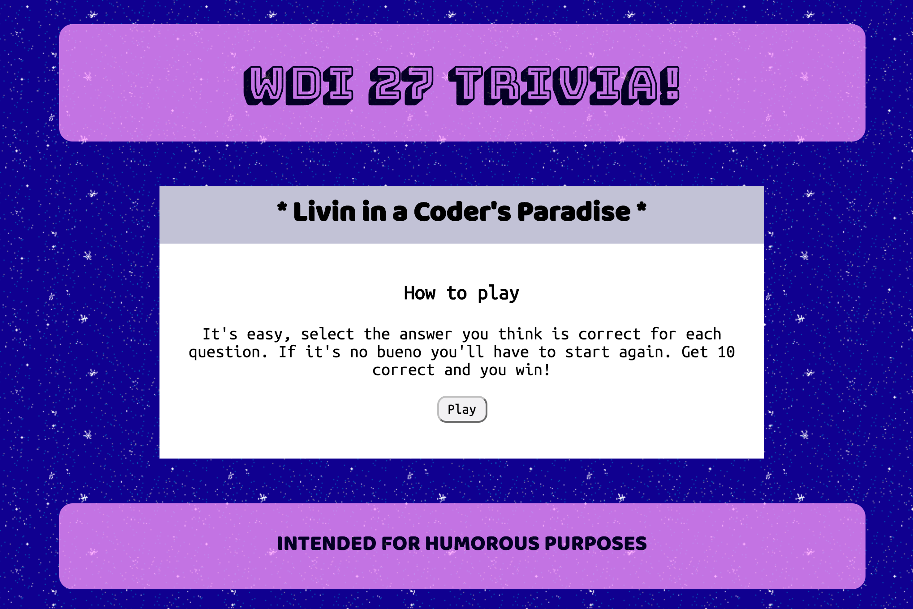
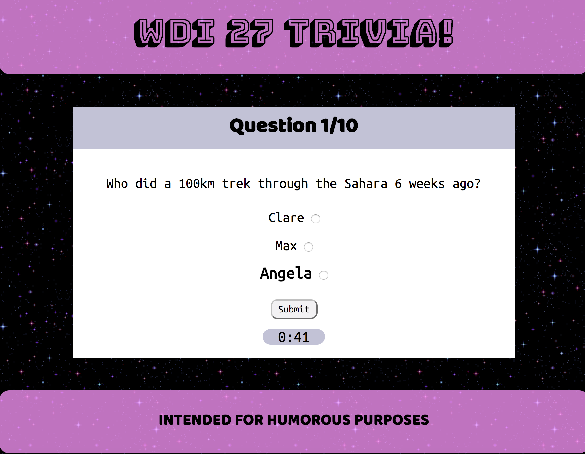

# Project 0: WDI 27 Trivia Game

Welcome to my repository for the ultimate trivia game for WDI 27 in London! For the first project for this course I created a web game for classmates to test their knowledge on how well they know each other. It is easy to follow, entertaining to play, and structured simply for those who would like to craft their own specially themed trivia game.

## Installation and Setup

Installation steps are listed below:

* Download or clone this repo
* copy `npm i` into you terminal to install dependencies
* run `gulp` in your terminal to compile the source code and open in browser
* _Enjoy_!

### A short description

WHI 27 Ultimate Trivia Game utilizes many images, gifs, audio files, and a few events.

The game is styled by using multiple divs with the class of hidden. As the player clicks on buttons, the hidden class is added or removed when necessary.

I created two JavaScript files that are easily repurposed for your own trivia game. The sheet _questionStorage.js_ is used for storing questions, their answers, and corresponding media as an array. The sheet _app.js_ stores all of the functions and constants needed to run the game. You can change the timer, number of questions needed to be correct, and all media on this sheet.

To add to the comedic effect, I inputted gifs for each correct answer, and different audio files for when a player submits an answer and for the different stages of the gem: instructions, start, win, lose.

### Technologies used

These are the languages and softwares used in this game:

- HTML 5
- SCSS
- JavaScript ES6
- jQuery 3.10
- Gulp
- NPM
- Git & github
- Heroku

A shoutout to Giphy for supplying this game with some fun backgrounds and muy bueno gifs. They are a great source for comedic material. Additionally, the kind folks at Youtube offer many soundtracks and special effects available for free.

### Challenges faced

This game was fairly straightforward to build and conceptually made sense to me (which is why I built it). I had trouble with the timer.  Additionally, name spacing proved difficult as I tried to implement it, my game broke.

### Rounding it off

For improvements I'd like to:

- Improve the overall styling
- Complete name spacing
- Add hint or cheat option that supplies an answer once in a round
- Add different levels for question difficulty

Interested in following my future projects? Link with me on [Github](https://github.com/alexandriako).
